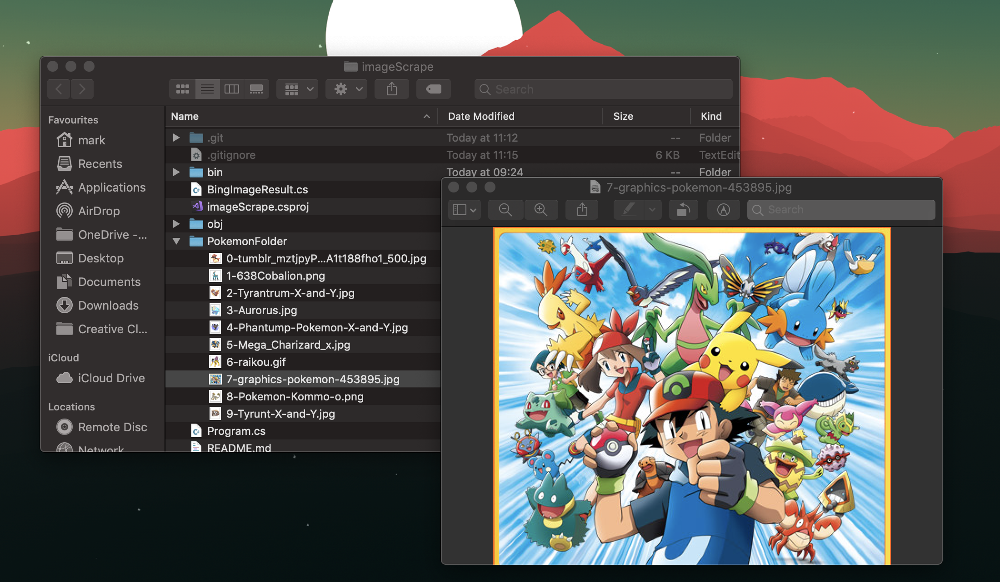

# .NET Bing Search Image Scraper

In order to test the console application run the following commands from the command line:

``` cmd
dotnet build
dotnet run <Search Query term> <Directory of output in relation to application location> <number of images you want scrapped>
```
### Example 

``` cmd
dotnet run Pokemon /PokemonFolder 10
```

The cmd above should provide an output like this.
```
Setting up directory /Users/mark/Source/repos/imageScrape/PokemonFolder
Setting up http client
Start the scrap for Pokemon!
fetching https://78.media.tumblr.com/7cba787703e0343eb0c55aa40f8aa37f/tumblr_mztjpyPU3A1t188fho1_500.jpg
fetching http://img2.wikia.nocookie.net/__cb20140329053459/pokemon/images/6/65/638Cobalion.png
fetching http://oyster.ignimgs.com/wordpress/stg.ign.com/2013/09/Tyrantrum-X-and-Y.jpg
fetching http://4.bp.blogspot.com/--wMITqatPNU/UkBYQzw5w3I/AAAAAAAAAQ4/tEUgblwTiK0/s1600/Aurorus.jpg
fetching https://gamingreinvented.com/wp-content/uploads/2013/11/Phantump-Pokemon-X-and-Y.jpg
fetching http://1.bp.blogspot.com/-FacWUwmnzc0/UkwqnjmtUvI/AAAAAAAAAYE/tYbGJx_YnSw/s1600/Mega_Charizard_x.jpg
fetching http://www.absoluteanime.com/pokemon/raikou.gif
fetching http://www.picgifs.com/graphics/p/pokemon/graphics-pokemon-453895.jpg
fetching https://honeysanime.com/wp-content/uploads/2017/10/Pokemon-Kommo-o.png
fetching http://leviathyn.com/wp-content/uploads/2013/09/Tyrunt-X-and-Y.jpg
```


**API_KEY must be provided.**

*TODO: Compressive documentation.*

